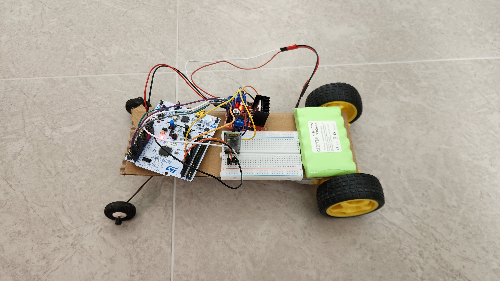

# Bluetooth Remote Control Car

Toy car hobbyist project using the STM32F466RE to learn embedded development.

## Hardware

- L289N Motor Driver
- HC-05 Bluetooth Module
- 7.2V NiMH battery
- STM Nucleo-F466RE
- Generic TT motor + wheels
- Frame + wiring built with random materials, solder and hot glue

## MCU software

The MCU is responsible for two features:
- Motor control
    -  Clockwise / counterclockwise spin of each wheel, using GPIO
    -  Spin speed of each motor, using PWM

- Bluetooth RF
    - TX and RX for remote motor control, using UART
    - Paired with a mobile interface for smooth control
    - Emergency motor stop on signal loss, using heartbeat timeouts 

## Serial commands

The motors can be controlled directly through UART / serial commands.

HC-05 settings: 
- Baud rate: 115200 (adjustable via AT commands)
- Parity: none
- Data bits: 8
- Stop bits: 1

8 byte frame:
- Byte 1: Left motor on / off
- Byte 2: Left motor spin direction
- Byte 3-4: Left motor spin speed
- Byte 5: Right motor on / off
- Byte 6: Right motor spin direction
- Byte 7-8: Right motor spin speed

## Future improvements

- Improve frame, wiring, front wheel design
    - If a stable frame is built, integrate PID self balancing using MPU6050 gyro sensor
- Migrate to blue pill board to save space / utilize breadboard
- Improve React Native mobile application remote control interface
- Reduce RF latency